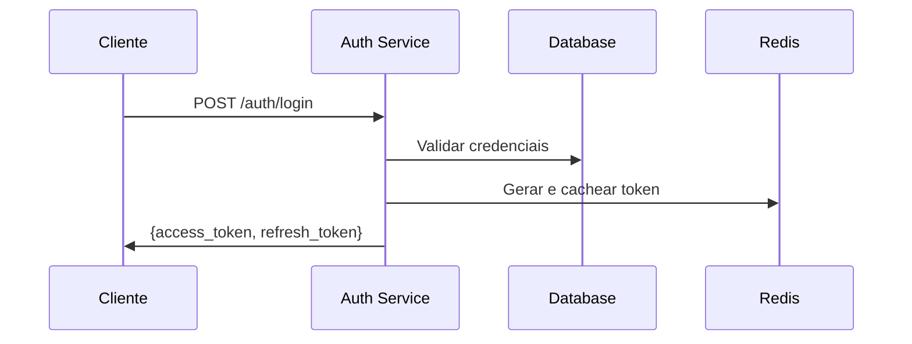
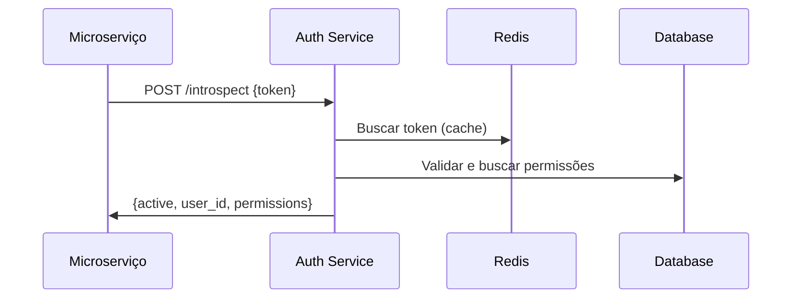

# Auth Service - Microserviço de Autenticação
## RTech Solution


Sistema centralizado de autenticação e autorização baseado em **Opaque Tokens** com introspection para múltiplos serviços SaaS multi-tenant.

## 🎯 Características Principais

- ✅ **Opaque Tokens** + Introspection para evitar JWT pesado
- ✅ **Multi-tenancy** com isolamento completo de dados
- ✅ **RBAC + ABAC** para controle de acesso granular
- ✅ **Cache multi-camada** (Redis + Local) para alta performance
- ✅ **Escalabilidade horizontal** sem estado compartilhado
- ✅ **Segurança em múltiplas camadas** (Rate limiting, Bcrypt, SSL/TLS)
- ✅ **Auditoria completa** de todas ações
- ✅ **Docker-ready** com health checks

## 📋 Pré-requisitos

- Node.js 20 LTS
- PostgreSQL 16+
- Redis 7+
- Docker & Docker Compose

## 🚀 Quick Start

### 1. Clonar e instalar dependências

```bash
git clone https://github.com/RTech-Solucoes/auth-api.git
cd auth-api
npm install
```

### 2. Configurar variáveis de ambiente

```bash
cp .env.example .env
# Editar .env com suas configurações
```

> Este projeto utiliza a flag nativa `--env-file` do Node.js (disponível a partir do Node.js 20.6) para carregar
> as variáveis de ambiente, dispensando o uso da biblioteca `dotenv`.
> Os scripts do `package.json` já estão configurados com `--env-file .env`.

### 3. Iniciar banco de dados (Docker)

```bash
docker-compose up -d postgres redis
```

### 4. Executar migrations

```bash
npx drizzle-kit generate
npx drizzle-kit migrate
npm run db:seed  # Opcional: dados de teste
```

### 5. Iniciar aplicação

```bash
# Desenvolvimento
npm run start:dev

# Produção
npm run build
npm run start:prod
```

A API estará disponível em: `http://localhost:3000`

Documentação Swagger: `http://localhost:3000/api`

## 📁 Estrutura do Projeto

```
auth-service/
├── src/
│   ├── db/
│   │   └── schema.ts      # Drizzle schema definitions
│   ├── auth/              # Módulo de autenticação
│   ├── users/             # Gerenciamento de usuários
│   ├── tenants/           # Gerenciamento de tenants
│   ├── roles/             # Perfis e permissões
│   ├── projects/          # Projetos por tenant
│   ├── audit/             # Auditoria
│   └── cache/             # Redis cache
├── drizzle/               # Migrations geradas pelo drizzle-kit
├── test/                  # Testes
├── .env
├── drizzle.config.ts
└── docs/                  # Documentação adicional
```

## 🔑 Endpoints Principais

### Autenticação

```http
POST   /auth/register      # Registrar novo usuário
POST   /auth/login         # Login
POST   /auth/logout        # Logout
POST   /auth/refresh       # Refresh token
POST   /auth/introspect    # Validar token (para serviços)
```

### Usuários

```http
GET    /users              # Listar usuários
GET    /users/:id          # Buscar usuário
POST   /users              # Criar usuário
PUT    /users/:id          # Atualizar usuário
DELETE /users/:id          # Deletar usuário
```

### Tenants

```http
GET    /tenants            # Listar tenants
GET    /tenants/:id        # Buscar tenant
POST   /tenants            # Criar tenant
PUT    /tenants/:id        # Atualizar tenant
```

### Roles & Permissions

```http
GET    /roles              # Listar perfis
POST   /roles              # Criar perfil
POST   /roles/:id/permissions  # Atribuir permissões
GET    /permissions        # Listar permissões
```

## 🔒 Modelo de Autenticação

### Fluxo de Login



### Fluxo de Introspection



## 🎭 Exemplos de Uso

### 1. Registro de Usuário

```bash
curl -X POST http://localhost:3000/auth/register \
  -H "Content-Type: application/json" \
  -d '{
    "email": "user@example.com",
    "password": "SecurePass@123",
    "firstName": "John",
    "lastName": "Doe",
    "tenantId": "tenant-uuid"
  }'
```

### 2. Login

```bash
curl -X POST http://localhost:3000/auth/login \
  -H "Content-Type: application/json" \
  -d '{
    "email": "user@example.com",
    "password": "SecurePass@123",
    "tenantId": "tenant-uuid"
  }'
```

### 3. Introspection (de outro serviço)

```bash
curl -X POST http://localhost:3000/auth/introspect \
  -H "Content-Type: application/json" \
  -d '{
    "token": "abc123..."
  }'
```

### 4. Refresh Token

```bash
curl -X POST http://localhost:3000/auth/refresh \
  -H "Content-Type: application/json" \
  -d '{
    "refreshToken": "xyz789..."
  }'
```

## 📊 Performance

### Benchmarks Esperados

| Operação | Latência Média | Target |
|----------|---------------|--------|
| Login | 80-100ms | < 300ms |
| Introspection (cache hit) | 5-10ms | < 50ms |
| Introspection (cache miss) | 30-50ms | < 150ms |
| Refresh Token | 60-80ms | < 200ms |

### Capacidade

- **RPS**: 10.000+ requisições por segundo (com cache)
- **Concurrent Users**: 100.000+ tokens ativos simultâneos
- **Latência p95**: < 100ms para operações em cache
- **Uptime Target**: 99.95%

## 🔐 Segurança

### Boas Práticas Implementadas

- ✅ Bcrypt com 12 rounds para senhas
- ✅ Rate limiting em endpoints sensíveis
- ✅ CORS configurado
- ✅ Helmet para headers de segurança
- ✅ Input validation com class-validator
- ✅ SQL injection protection (Drizzle ORM)
- ✅ XSS protection
- ✅ Token rotation
- ✅ Audit logs completos
- ✅ HTTPS enforced (produção)

## 📚 Documentação

### Documentos Disponíveis

1. **[Visão Geral da Arquitetura](docs/01-visao-geral-arquitetura.md)**
   - Objetivos e componentes
   - Stack tecnológico
   - Modelo de tokens

2. **[Database Schema](docs/02-database-schema.md)**
   - Schema completo com Drizzle
   - Relacionamentos
   - Índices e otimizações

3. **[Guia de Implementação](docs/03-implementation-guide.md)**
   - Exemplos de código
   - Setup do projeto
   - Configurações

4. **[Boas Práticas e Segurança](docs/04-best-practices-security.md)**
   - Rate limiting
   - Password security
   - Performance optimization
   - Testes

### Diagramas

1. **[DER - Diagrama Entidade-Relacionamento](diagrams/01-DER.md)**
2. **[Diagrama de Classes](diagrams/02-class-diagram.md)**
3. **[Diagramas de Sequência](diagrams/03-sequence-diagrams.md)**
4. **[Infraestrutura](diagrams/04-infrastructure-diagram.md)**

## 🤝 Contribuindo

1. Fork o projeto
2. Crie uma branch para sua feature (`git checkout -b feature/AmazingFeature`)
3. Commit suas mudanças (`git commit -m 'Add some AmazingFeature'`)
4. Push para a branch (`git push origin feature/AmazingFeature`)
5. Abra um Pull Request

## 📝 License

Este projeto é propriedade da RTech Solution.


## 📅 Roadmap

### Fase 1 - MVP 
- [ ] Autenticação básica
- [ ] Opaque tokens
- [ ] Introspection
- [ ] Multi-tenancy

### Fase 2 - Em Desenvolvimento
- [ ] 2FA (TOTP)
- [ ] OAuth2/OIDC integration
- [ ] SSO (SAML, Google, Microsoft)
- [ ] Password policies por tenant

### Fase 3 - Planejado
- [ ] Biometria
- [ ] Risk-based authentication
- [ ] Machine learning para detecção de fraude
- [ ] WebAuthn/FIDO2

## 🎓 Referências

- [NestJS Documentation](https://docs.nestjs.com/)
- [Drizzle ORM](https://orm.drizzle.team/)
- [OAuth 2.0 Token Introspection](https://datatracker.ietf.org/doc/html/rfc7662)
- [NIST Digital Identity Guidelines](https://pages.nist.gov/800-63-3/)

---

**Made with ❤️ by RTech Solution**
