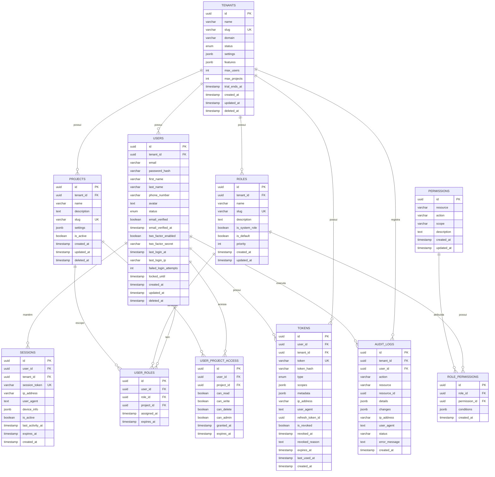

# Diagrama Entidade-Relacionamento (DER)
## Auth Service Database



## Relacionamentos Principais

### 1. Multi-Tenancy
- **TENANTS** é a raiz da hierarquia
- Todos os dados são isolados por `tenant_id`
- Suporta soft delete (`deleted_at`)

### 2. Autenticação e Autorização
- **USERS** pertence a um **TENANT**
- **USER_ROLES** associa usuários a perfis
- **ROLE_PERMISSIONS** define o que cada perfil pode fazer
- **PERMISSIONS** são granulares (resource + action + scope)

### 3. Gestão de Tokens
- **TOKENS** armazena Opaque Tokens
- Vinculado a **USER** e **TENANT**
- Suporta múltiplos tipos (access, refresh, reset, etc)
- Permite revogação imediata

### 4. Projetos
- **PROJECTS** pertencem a **TENANTS**
- **USER_PROJECT_ACCESS** controla acesso granular por projeto
- **USER_ROLES** pode ter escopo de projeto

### 5. Auditoria
- **AUDIT_LOGS** registra todas ações importantes
- Mantém histórico de mudanças (before/after)
- Rastreabilidade completa

## Cardinalidade

| Relacionamento | Tipo | Descrição |
|---------------|------|-----------|
| Tenant → Users | 1:N | Um tenant tem muitos usuários |
| Tenant → Projects | 1:N | Um tenant tem muitos projetos |
| User → Tokens | 1:N | Um usuário tem muitos tokens |
| User → Sessions | 1:N | Um usuário tem várias sessões |
| Role → Permissions | N:N | Perfis têm múltiplas permissões |
| User → Roles | N:N | Usuários têm múltiplos perfis |
| User → Projects | N:N | Usuários acessam múltiplos projetos |

## Estratégias de Otimização

### Particionamento
```sql
-- Particionar audit_logs por mês
CREATE TABLE audit_logs_2024_01 PARTITION OF audit_logs
    FOR VALUES FROM ('2024-01-01') TO ('2024-02-01');
```

### Índices Parciais
```sql
-- Índice apenas para tokens ativos
CREATE INDEX idx_active_tokens ON tokens (user_id, expires_at)
    WHERE is_revoked = false;
```

### Materialized Views
```sql
-- Cache de permissões por usuário
CREATE MATERIALIZED VIEW user_permissions_cache AS
SELECT 
    u.id as user_id,
    u.tenant_id,
    array_agg(DISTINCT p.resource || ':' || p.action) as permissions
FROM users u
JOIN user_roles ur ON ur.user_id = u.id
JOIN role_permissions rp ON rp.role_id = ur.role_id
JOIN permissions p ON p.id = rp.permission_id
WHERE u.deleted_at IS NULL
GROUP BY u.id, u.tenant_id;

-- Refresh automático a cada 5 minutos
CREATE INDEX ON user_permissions_cache (user_id);
REFRESH MATERIALIZED VIEW CONCURRENTLY user_permissions_cache;
```

## Constraints Importantes

```sql
-- Garantir que usuário não tenha role duplicada no mesmo projeto
ALTER TABLE user_roles ADD CONSTRAINT unique_user_role_project 
    UNIQUE (user_id, role_id, COALESCE(project_id, '00000000-0000-0000-0000-000000000000'));

-- Garantir que token não esteja expirado quando criado
ALTER TABLE tokens ADD CONSTRAINT check_token_expiry 
    CHECK (expires_at > created_at);

-- Garantir que tenant trial tenha data de fim
ALTER TABLE tenants ADD CONSTRAINT check_trial_end 
    CHECK (status != 'trial' OR trial_ends_at IS NOT NULL);
```
