# Diagrama de Classes - NestJS Architecture
## Auth Service

```mermaid
classDiagram
    %% ==========================================
    %% AUTH MODULE
    %% ==========================================
    
    class AuthModule {
        +imports: Module[]
        +controllers: Controller[]
        +providers: Provider[]
    }
    
    class AuthController {
        -authService: AuthService
        +login(dto: LoginDto): Promise~AuthResponse~
        +register(dto: RegisterDto): Promise~AuthResponse~
        +logout(token: string): Promise~void~
        +refresh(refreshToken: string): Promise~AuthResponse~
        +introspect(token: string): Promise~IntrospectionResponse~
    }
    
    class AuthService {
        -tokenService: TokenService
        -userService: UserService
        -sessionService: SessionService
        -auditService: AuditService
        +validateUser(email, password): Promise~User~
        +login(user, metadata): Promise~AuthResponse~
        +logout(token): Promise~void~
        +introspectToken(token): Promise~IntrospectionResponse~
        +refreshToken(refreshToken): Promise~AuthResponse~
    }
    
    class TokenService {
        -redis: Redis
        -drizzle: DrizzleService
        +generateOpaqueToken(): string
        +createToken(userId, tenantId, type): Promise~Token~
        +validateToken(token): Promise~Token~
        +revokeToken(token): Promise~void~
        +getTokenInfo(token): Promise~TokenInfo~
        +storeInCache(token, data, ttl): Promise~void~
        +getFromCache(token): Promise~TokenData~
    }
    
    class IntrospectionService {
        -tokenService: TokenService
        -permissionService: PermissionService
        -cache: CacheService
        +introspect(token): Promise~IntrospectionResponse~
        +validateAndGetPermissions(token): Promise~UserPermissions~
        -buildIntrospectionResponse(token, user): IntrospectionResponse
    }
    
    %% ==========================================
    %% USER MODULE
    %% ==========================================
    
    class UserModule {
        +imports: Module[]
        +controllers: Controller[]
        +providers: Provider[]
    }
    
    class UserController {
        -userService: UserService
        +create(dto: CreateUserDto): Promise~User~
        +findAll(filters): Promise~User[]~
        +findOne(id): Promise~User~
        +update(id, dto): Promise~User~
        +delete(id): Promise~void~
        +changePassword(id, dto): Promise~void~
    }
    
    class UserService {
        -drizzle: DrizzleService
        -cache: CacheService
        -roleService: RoleService
        +create(data): Promise~User~
        +findById(id): Promise~User~
        +findByEmail(email, tenantId): Promise~User~
        +update(id, data): Promise~User~
        +delete(id): Promise~void~
        +hashPassword(password): Promise~string~
        +validatePassword(password, hash): Promise~boolean~
        +assignRole(userId, roleId): Promise~void~
    }
    
    %% ==========================================
    %% TENANT MODULE
    %% ==========================================
    
    class TenantModule {
        +imports: Module[]
        +controllers: Controller[]
        +providers: Provider[]
    }
    
    class TenantController {
        -tenantService: TenantService
        +create(dto: CreateTenantDto): Promise~Tenant~
        +findAll(): Promise~Tenant[]~
        +findOne(id): Promise~Tenant~
        +update(id, dto): Promise~Tenant~
        +updateSettings(id, settings): Promise~Tenant~
    }
    
    class TenantService {
        -drizzle: DrizzleService
        -cache: CacheService
        +create(data): Promise~Tenant~
        +findById(id): Promise~Tenant~
        +findBySlug(slug): Promise~Tenant~
        +update(id, data): Promise~Tenant~
        +getSettings(tenantId): Promise~Settings~
        +updateSettings(tenantId, settings): Promise~void~
    }
    
    %% ==========================================
    %% ROLE & PERMISSION MODULE
    %% ==========================================
    
    class RoleModule {
        +imports: Module[]
        +controllers: Controller[]
        +providers: Provider[]
    }
    
    class RoleController {
        -roleService: RoleService
        +create(dto: CreateRoleDto): Promise~Role~
        +findAll(tenantId): Promise~Role[]~
        +findOne(id): Promise~Role~
        +update(id, dto): Promise~Role~
        +assignPermissions(roleId, permissions): Promise~void~
    }
    
    class RoleService {
        -drizzle: DrizzleService
        -permissionService: PermissionService
        -cache: CacheService
        +create(data): Promise~Role~
        +findById(id): Promise~Role~
        +update(id, data): Promise~Role~
        +assignPermission(roleId, permissionId): Promise~void~
        +getRolePermissions(roleId): Promise~Permission[]~
        +getUserRoles(userId): Promise~Role[]~
    }
    
    class PermissionService {
        -drizzle: DrizzleService
        -cache: CacheService
        +create(data): Promise~Permission~
        +findAll(): Promise~Permission[]~
        +getUserPermissions(userId): Promise~Permission[]~
        +checkPermission(userId, resource, action): Promise~boolean~
        +cacheUserPermissions(userId, permissions): Promise~void~
        +invalidateCache(userId): Promise~void~
    }
    
    class AuthorizationService {
        -permissionService: PermissionService
        -cache: CacheService
        +can(userId, resource, action, context): Promise~boolean~
        +evaluate(userId, policy): Promise~boolean~
        +getEffectivePermissions(userId, projectId): Promise~Permission[]~
    }
    
    %% ==========================================
    %% PROJECT MODULE
    %% ==========================================
    
    class ProjectModule {
        +imports: Module[]
        +controllers: Controller[]
        +providers: Provider[]
    }
    
    class ProjectController {
        -projectService: ProjectService
        +create(dto: CreateProjectDto): Promise~Project~
        +findAll(tenantId): Promise~Project[]~
        +findOne(id): Promise~Project~
        +grantAccess(projectId, userId, permissions): Promise~void~
    }
    
    class ProjectService {
        -drizzle: DrizzleService
        -cache: CacheService
        +create(data): Promise~Project~
        +findById(id): Promise~Project~
        +update(id, data): Promise~Project~
        +grantUserAccess(projectId, userId, permissions): Promise~void~
        +revokeUserAccess(projectId, userId): Promise~void~
        +getUserProjects(userId): Promise~Project[]~
    }
    
    %% ==========================================
    %% AUDIT MODULE
    %% ==========================================
    
    class AuditModule {
        +imports: Module[]
        +providers: Provider[]
    }
    
    class AuditService {
        -drizzle: DrizzleService
        -queue: BullQueue
        +log(action, userId, resource, details): Promise~void~
        +logLogin(userId, ip, userAgent, success): Promise~void~
        +logPermissionChange(roleId, permission, granted): Promise~void~
        +getAuditTrail(filters): Promise~AuditLog[]~
    }
    
    class AuditInterceptor {
        -auditService: AuditService
        +intercept(context, next): Observable
    }
    
    %% ==========================================
    %% SHARED/INFRASTRUCTURE
    %% ==========================================
    
    class DrizzleService {
        -db: Database
        -config: DatabaseConfig
        +getDb(): Database
        +transaction(callback): Promise~T~
        +query(): QueryBuilder
    }
    
    class CacheService {
        -redis: Redis
        -defaultTTL: number
        +get(key): Promise~T~
        +set(key, value, ttl): Promise~void~
        +del(key): Promise~void~
        +keys(pattern): Promise~string[]~
        +flush(): Promise~void~
        +remember(key, ttl, callback): Promise~T~
    }
    
    class SessionService {
        -redis: Redis
        -drizzle: DrizzleService
        +create(userId, metadata): Promise~Session~
        +findById(sessionId): Promise~Session~
        +update(sessionId, data): Promise~void~
        +revoke(sessionId): Promise~void~
        +getUserActiveSessions(userId): Promise~Session[]~
    }
    
    class RateLimiterService {
        -redis: Redis
        +consume(key, points): Promise~boolean~
        +checkLimit(key, limit, window): Promise~boolean~
        +reset(key): Promise~void~
    }
    
    %% ==========================================
    %% GUARDS & DECORATORS
    %% ==========================================
    
    class JwtAuthGuard {
        -tokenService: TokenService
        +canActivate(context): Promise~boolean~
    }
    
    class PermissionGuard {
        -permissionService: PermissionService
        +canActivate(context): Promise~boolean~
        -extractPermission(handler): string[]
    }
    
    class TenantGuard {
        -tenantService: TenantService
        +canActivate(context): Promise~boolean~
        -extractTenantId(request): string
    }
    
    class RateLimitGuard {
        -rateLimiter: RateLimiterService
        +canActivate(context): Promise~boolean~
    }
    
    %% ==========================================
    %% DTOs & ENTITIES
    %% ==========================================
    
    class User {
        +id: string
        +tenantId: string
        +email: string
        +passwordHash: string
        +firstName: string
        +lastName: string
        +status: UserStatus
        +emailVerified: boolean
        +twoFactorEnabled: boolean
        +createdAt: Date
        +updatedAt: Date
    }
    
    class Token {
        +id: string
        +userId: string
        +tenantId: string
        +token: string
        +type: TokenType
        +scopes: string[]
        +expiresAt: Date
        +isRevoked: boolean
        +createdAt: Date
    }
    
    class Tenant {
        +id: string
        +name: string
        +slug: string
        +status: TenantStatus
        +settings: object
        +maxUsers: number
        +createdAt: Date
    }
    
    class Role {
        +id: string
        +tenantId: string
        +name: string
        +slug: string
        +isSystemRole: boolean
        +priority: number
        +createdAt: Date
    }
    
    class Permission {
        +id: string
        +resource: string
        +action: string
        +scope: string
        +description: string
    }
    
    %% ==========================================
    %% RELATIONSHIPS
    %% ==========================================
    
    AuthModule --> AuthController
    AuthModule --> AuthService
    AuthModule --> IntrospectionService
    
    AuthController --> AuthService
    AuthService --> TokenService
    AuthService --> UserService
    AuthService --> SessionService
    AuthService --> AuditService
    
    IntrospectionService --> TokenService
    IntrospectionService --> PermissionService
    IntrospectionService --> CacheService
    
    UserModule --> UserController
    UserModule --> UserService
    UserController --> UserService
    UserService --> RoleService
    UserService --> DrizzleService
    UserService --> CacheService
    
    TenantModule --> TenantController
    TenantModule --> TenantService
    TenantController --> TenantService
    TenantService --> DrizzleService
    TenantService --> CacheService
    
    RoleModule --> RoleController
    RoleModule --> RoleService
    RoleController --> RoleService
    RoleService --> PermissionService
    RoleService --> DrizzleService
    
    PermissionService --> CacheService
    PermissionService --> DrizzleService
    AuthorizationService --> PermissionService
    
    ProjectModule --> ProjectController
    ProjectModule --> ProjectService
    ProjectController --> ProjectService
    ProjectService --> DrizzleService
    
    AuditModule --> AuditService
    AuditModule --> AuditInterceptor
    AuditInterceptor --> AuditService
    
    TokenService --> DrizzleService
    TokenService --> CacheService
    
    JwtAuthGuard --> TokenService
    PermissionGuard --> PermissionService
    TenantGuard --> TenantService
    RateLimitGuard --> RateLimiterService
    
    User --> Tenant
    Token --> User
    Token --> Tenant
    Role --> Tenant
    Role --> Permission
```



## Estrutura de Módulos NestJS

```
src/
├── auth/
│   ├── auth.module.ts
│   ├── auth.controller.ts
│   ├── auth.service.ts
│   ├── introspection.service.ts
│   ├── token.service.ts
│   ├── guards/
│   │   ├── jwt-auth.guard.ts
│   │   └── rate-limit.guard.ts
│   └── dto/
│       ├── login.dto.ts
│       ├── register.dto.ts
│       └── introspection.dto.ts
│
├── users/
│   ├── user.module.ts
│   ├── user.controller.ts
│   ├── user.service.ts
│   └── dto/
│       ├── create-user.dto.ts
│       └── update-user.dto.ts
│
├── tenants/
│   ├── tenant.module.ts
│   ├── tenant.controller.ts
│   ├── tenant.service.ts
│   └── guards/
│       └── tenant.guard.ts
│
├── roles/
│   ├── role.module.ts
│   ├── role.controller.ts
│   ├── role.service.ts
│   ├── permission.service.ts
│   ├── authorization.service.ts
│   └── guards/
│       └── permission.guard.ts
│
├── projects/
│   ├── project.module.ts
│   ├── project.controller.ts
│   └── project.service.ts
│
├── audit/
│   ├── audit.module.ts
│   ├── audit.service.ts
│   └── interceptors/
│       └── audit.interceptor.ts
│
├── shared/
│   ├── database/
│   │   ├── drizzle.service.ts
│   │   └── schema/
│   ├── cache/
│   │   └── cache.service.ts
│   ├── session/
│   │   └── session.service.ts
│   └── rate-limiter/
│       └── rate-limiter.service.ts
│
└── app.module.ts
```

## Padrões de Design Utilizados

### 1. **Dependency Injection**
NestJS gerencia injeção de dependências automaticamente.

### 2. **Repository Pattern**
DrizzleService encapsula acesso ao banco de dados.

### 3. **Guard Pattern**
Guards para autenticação, autorização e rate limiting.

### 4. **Interceptor Pattern**
AuditInterceptor para logging automático.

### 5. **Service Layer Pattern**
Lógica de negócio separada dos controllers.

### 6. **DTO Pattern**
Validação e transformação de dados de entrada.

### 7. **Cache-Aside Pattern**
CacheService implementa estratégia de cache.

## Responsabilidades das Classes

### Controllers
- Validação de entrada (DTOs)
- Roteamento HTTP
- Resposta HTTP
- Documentação OpenAPI

### Services
- Lógica de negócio
- Orquestração de operações
- Transações de banco
- Regras de validação

### Guards
- Autenticação
- Autorização
- Rate limiting
- Validação de tenant

### Interceptors
- Logging
- Transformação de resposta
- Tratamento de erros
- Performance monitoring
