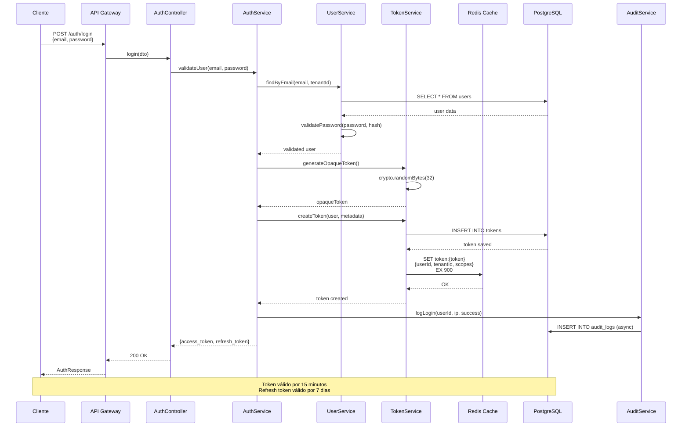
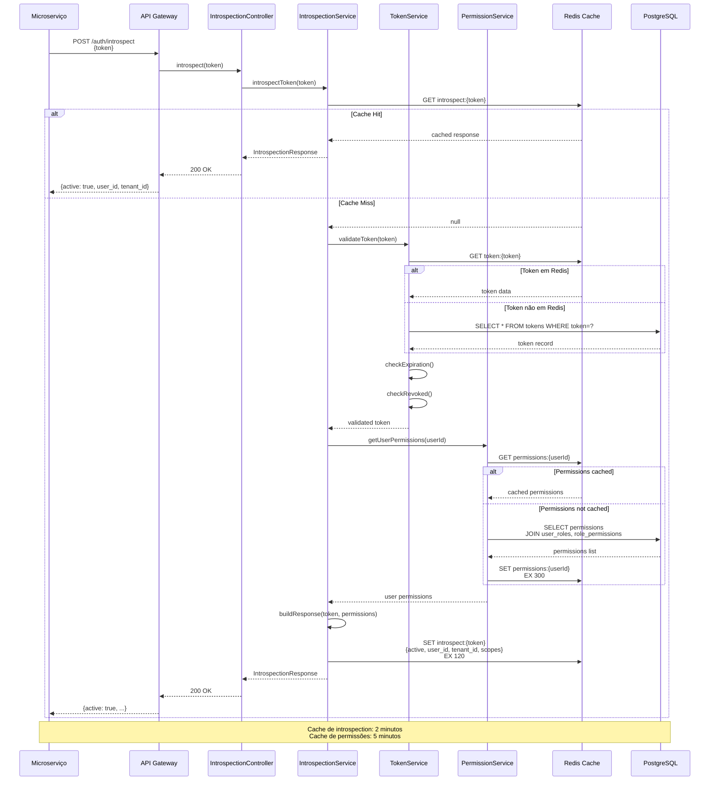
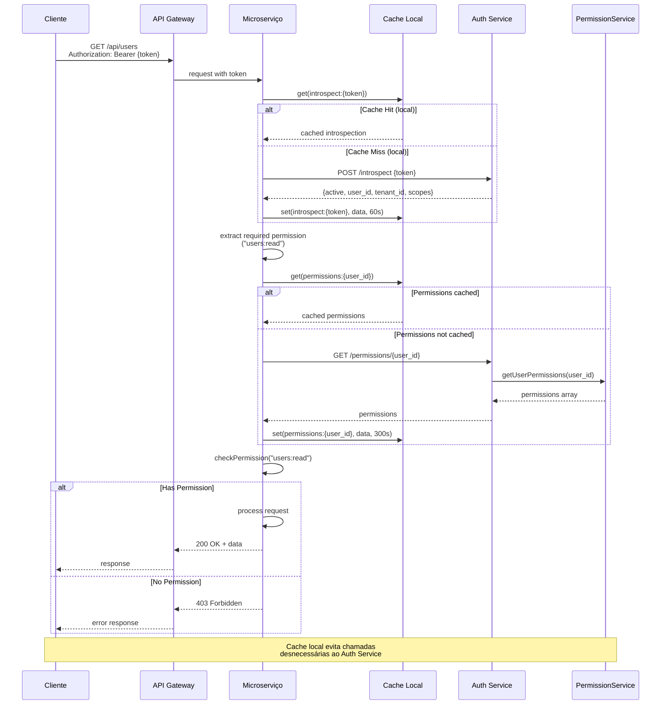
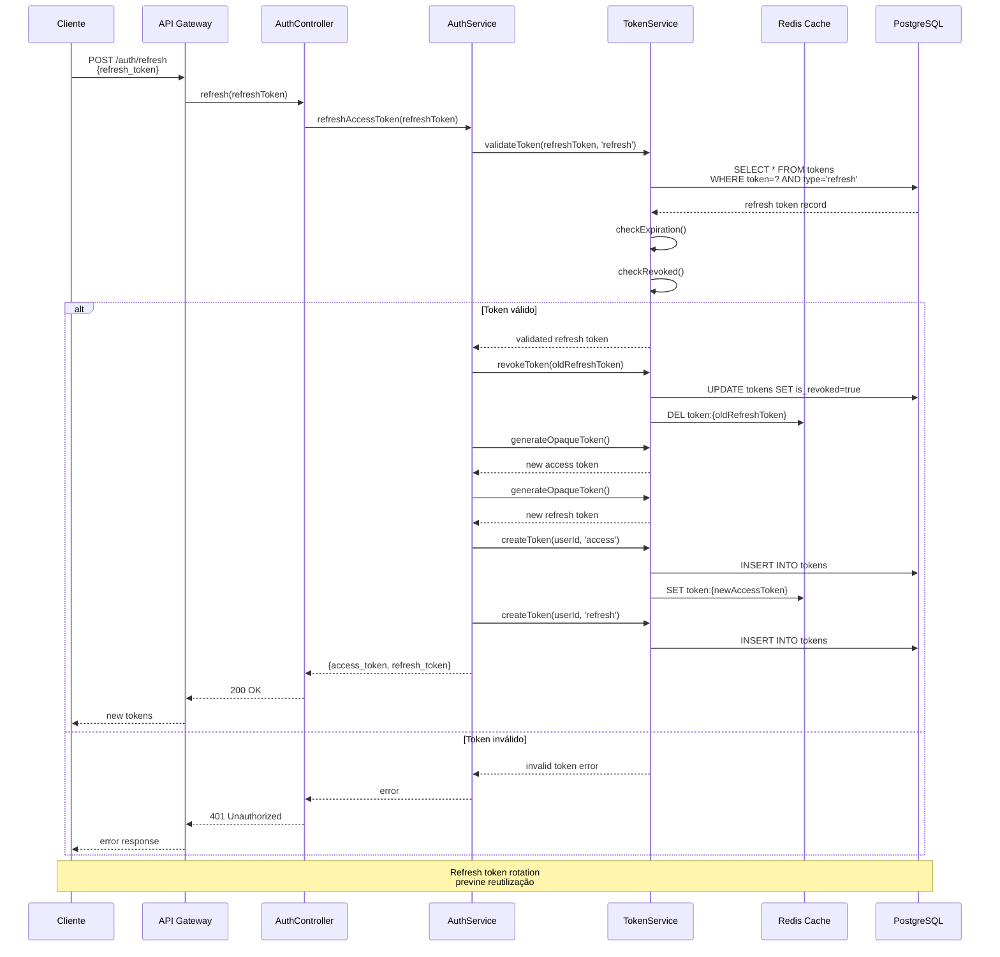
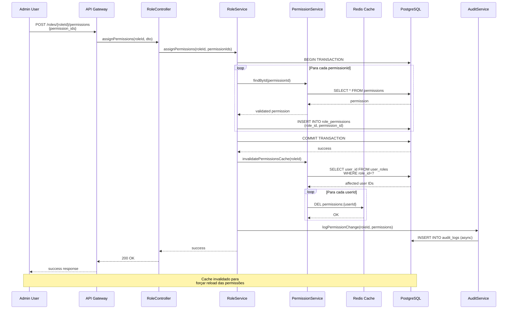
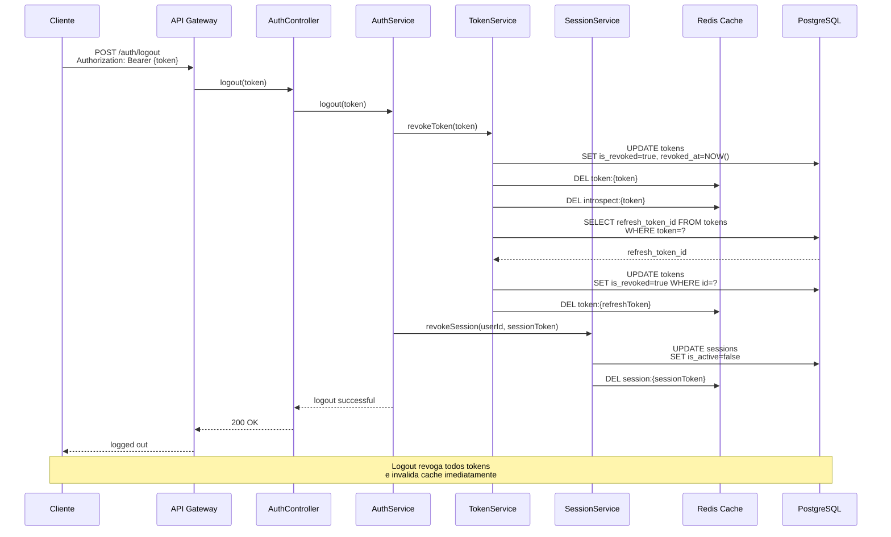

# Diagramas de Sequência - Fluxos de Execução
## Auth Service

## 1. Fluxo de Login e Autenticação

## 2. Fluxo de Introspection (Token Validation)

## 3. Fluxo de Request com Autorização

## 4. Fluxo de Refresh Token

## 5. Fluxo de Atribuição de Permissões

## 6. Fluxo de Logout e Revogação de Token

## Tempos de Resposta Esperados

| Operação | Target | Máximo Aceitável |
|----------|--------|------------------|
| Login | < 100ms | 300ms |
| Introspection (cache hit) | < 10ms | 50ms |
| Introspection (cache miss) | < 50ms | 150ms |
| Refresh Token | < 80ms | 200ms |
| Logout | < 50ms | 150ms |
| Permission Check | < 20ms | 100ms |

## Estratégias de Otimização

### 1. Cache Multi-Camada
- **L1**: Cache local nos microserviços (1-2 min)
- **L2**: Redis centralizado (5-15 min)
- **L3**: Banco de dados

### 2. Connection Pooling
- PostgreSQL: pool de 20 conexões
- Redis: pool de 10 conexões

### 3. Batch Operations
- Introspection de múltiplos tokens em uma chamada
- Verificação de múltiplas permissões simultaneamente

### 4. Async Processing
- Auditoria em background (não bloqueia response)
- Notificações assíncronas
- Limpeza de tokens expirados

### 5. Query Optimization
- Índices estratégicos
- Materialized views para permissões
- Prepared statements
